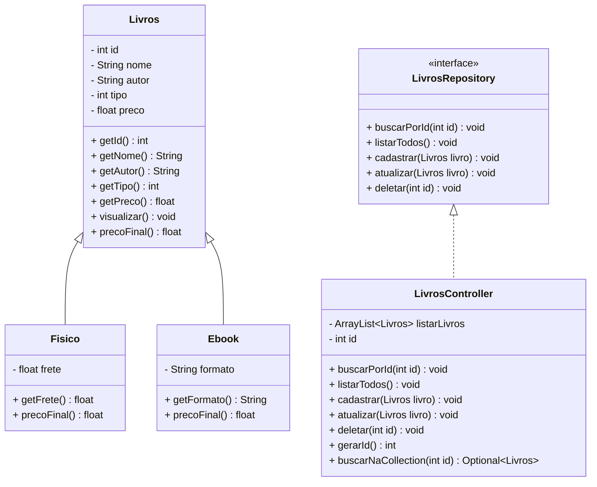

# # 📚 Livraria Letras Vivas(e-commerce) - Java
<br />

<div align="center">  </div>
<br />


# Descrição
<br />

Bem-vindo ao repositório do projeto **Livraria Letras Vivas**, uma aplicação de console Java que simula o cadastro e gerenciamento de livros físicos e ebooks. Este projeto foi desenvolvido como parte do Bloco 01 da Generation Brasil com foco em Programação Orientada a Objetos (POO) e práticas de boas estruturas em Java.

Este projeto, desenvolvido em Java, foca no estudo e aplicação dos conceitos de Programação Orientada a Objetos (POO), incluindo:

Classes e Objetos;
Atributos e Métodos;
Modificadores de Acesso;
Herança e Polimorfismo;
Classes Abstratas;
Interfaces.
Além de servir como um simulador funcional, o projeto oferece uma base prática para compreender os princípios fundamentais da POO aplicados a um cenário realista.


## 📦 Funcionalidades

- Cadastro de livros físicos e ebooks
- Listagem de todos os livros cadastrados
- Busca de livro por ID
- Atualização de informações do livro
- Exclusão de livros
- Cálculo de preço final:
  - Ebook: desconto de 10%
  - Livro físico: adição de valor de frete
<br />

## 🧠 Conceitos aplicados

- Abstração e encapsulamento
- Herança e polimorfismo
- Sobrescrita de métodos (`@Override`)
- Implementação de interfaces
- Controle de fluxo com `switch`, `if`, `while`
- Listas genéricas com `ArrayList`
- Organização de código em pacotes (`model`, `controller`, `repository`)

# Diagrama de Classes
<br />

Um Diagrama de Classes é um modelo visual usado na programação orientada a objetos para representar a estrutura de um sistema. Ele exibe classes, atributos, métodos e os relacionamentos entre elas, como associações, heranças e dependências.

Esse diagrama ajuda a planejar e entender a arquitetura do sistema, mostrando como os componentes interagem e se conectam. É amplamente utilizado nas fases de design e documentação de projetos.

Abaixo, você confere o Diagrama de Classes do Projeto Livraria Letras Vivas(e-commerce):

<br />

# Tela Inicial do Sistema - Menu
<br />

<div align="center">  </div>
<br />

## Requisitos

<br />

Para executar os códigos localmente, você precisará de:

- [Java JDK 17+](https://www.oracle.com/java/technologies/javase/jdk17-archive-downloads.html)
- [Eclipse](https://eclipseide.org/) ou [STS](https://spring.io/tools)

<br />

## Como Executar o projeto no Eclipse/STS

<br />

### Importando o Projeto

1. Clone o repositório do Projeto [Projeto Livraria](https://github.com/scaglia-aylla1/projeto_final_bloco_01.) dentro da pasta do *Workspace* do Eclipse/STS

```bash
git clone https://github.com/scaglia-aylla1/projeto_final_bloco_01.
```

2. **Abra o Eclipse/STS** e selecione a pasta do *Workspace* onde você clonou o repositório do projeto
3. No menu superior do Eclipse/STS, clique na opção: **File 🡲 Import...**
4. Na janela **Import**, selecione a opção: **General 🡲 Existing Projects into Workspace** e clique no botão **Next**
5. Na janela **Import Projects**, no item **Select root directory**, clique no botão **Browse...** e selecione a pasta do Workspace onde você clonou o repositório do projeto
6. O Eclipse/STS reconhecerá automaticamente o projeto
7. Marque o Projeto Conta Bancária no item **Projects** e clique no botão **Finish** para concluir a importação

<br />

### Executando o projeto

1. Na guia **Package Explorer**, localize o Projeto Farmacia Java
2. Abra a **Classe Menu**
3. Clique no botão **Run**  para executar a aplicação
4. Caso seja perguntado qual é o tipo do projeto, selecione a opção **Java Application**
5. O console exibirá o menu do Projeto.

<br />

## Contribuição

<br />

Este repositório é parte de um projeto educacional, mas contribuições são sempre bem-vindas! Caso tenha sugestões, correções ou melhorias, fique à vontade para:

- Criar uma **issue**
- Enviar um **pull request**
- Compartilhar com colegas que estejam aprendendo Java!

<br />

## Contato

<br />

Desenvolvido por [**Aylla Scaglia**](https://github.com/scaglia-aylla1) no Bootcamp Generation Brasil.
Para dúvidas, sugestões ou colaborações, entre em contato via GitHub ou abra uma issue!
